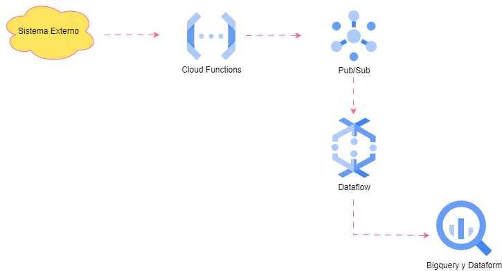
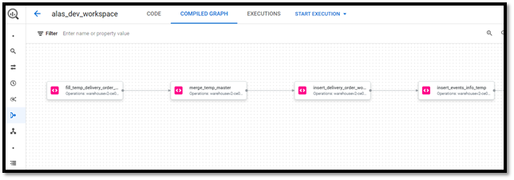

# Case Study 2 (Data Transformation Process on GCP using ELT)

This document details the implementation of a real-time order processing system using an ELT approach on the Google Cloud Platform (GCP). The system improves efficiency and reduces costs by leveraging GCP services such as Pub/Sub, Dataflow, BigQuery, and Dataform. This documentation focuses on data extraction, the load and transform process, and the automation of data pipelines for business analysis.

## Introduction
The need to process large volumes of real-time order data led us to evaluate and migrate from a traditional ETL approach to a more flexible and scalable ELT approach. This change allows for data manipulation directly in our data warehouse, BigQuery, optimizing costs and processing time.

## System Architecture
The designed architecture focuses on the ingestion of real-time order events, their initial processing for cleaning and transformation, and loading into BigQuery for more complex transformations and analysis.

## Data Flow
**Extraction:** Orders are captured and sent in JSON format each time they change state. Unlike the **[Case Study 1](https://github.com/rocamil85/Case-Study-1-ETL-Approach)** where orders were queried every day at 2:00 am from Cloud Run, here it is decided that the "third-party system" sends the order in real-time each time it is created or changes state.

**Pub/Sub:** A Cloud Function receives the orders and publishes them on a Pub/Sub topic designed for real-time event ingestion.

**Dataflow:** A Dataflow job subscribes to the Pub/Sub topic, performs initial cleaning and format transformations, and loads the data into BigQuery.

**BigQuery and Dataform:** Within BigQuery, Dataform scripts are used for additional transformations, data structuring, and preparation for business analysis.

## Architecture Diagram

## Component Details
### Google Cloud Pub/Sub
Google Cloud Pub/Sub is used for decoupling data-producing services from consumers. This approach ensures scalable and reliable message processing. A specific topic for orders was set up, where each state change is published in real-time by a Cloud Function.

### Google Cloud Dataflow
Dataflow processes data from Pub/Sub (with a PULL-type subscription) to perform initial cleaning and simple transformations for compatibility with the BigQuery schema. In this case, Dataflow is used as a streaming channel with simple data cleaning, but not to carry the full weight of the transformations, which will be performed in BigQuery. This step simply includes filtering irrelevant fields and converting data types. The choice of Dataflow is due to its ability to handle large volumes of streaming data, its automatic scalability, and its native integration with other GCP services.

First, the Beam pipeline is developed in Jupyter Notebook (Dataflow Workbench), to take advantage of data exploration capabilities, visualization, and intermediate tests that are useful during the development of the pipeline, DirectRunner is also used to execute this pipeline and see a progressive result.

Once a baseline of the pipeline is available, it is then transferred to a more suitable development environment for further testing, development, and deployment. Then, the development is tested in a Python virtual environment to ensure functionality with the appropriate dependencies.

Then, the design of Unit Tests using the Python UnitTest Framework is proceeded with. It consists of developing multiple unit tests that must subsequently be executed when the project (pipeline) is deployed.

Then, a CI/CD flow is designed through the cloudbuild.yaml file and the Cloud Build tool. The goal is that when a push is made to a branch, for example, Staging in Cloud Source Repositories, the cloudbuild.yaml file is executed (this is done by configuring a Cloud Build trigger that reads the .yaml). This .yaml defines a series of steps in order during deployment to the repository prioritizing the automatic execution of unit tests and if they pass correctly continues processing the beam pipeline. (_**See App dataflow-repository**_).

### BigQuery and Dataform
Once in BigQuery, we use Dataform to manage complex transformations and data preparation for analysis. Dataform allows defining and automating SQL data transformation workflows, facilitating task orchestration and dependencies between them. Additionally, its integration with version control systems like Git enables efficient collaboration and tracking of changes in transformation scripts.

 
 

### Dataform Scheduling
Dataform scripts are scheduled to run every 10 minutes, using time-based triggers. This frequency ensures that the data are constantly updated and ready for analysis in final tables. The configuration is done through the Dataform interface, specifying the Git repository branch to use, allowing for continuous integration and delivery (CI/CD) of changes in the transformation scripts.

## Conclusions
The implementation of this ELT system on GCP has allowed for more efficient and cost-effective data processing. The designed architecture ensures that data are available and up-to-date for analysis, supporting business decision-making in real-time. This project highlights the versatility and power of GCP tools to tackle complex data engineering challenges.
