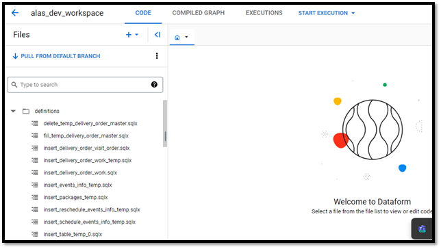

# Caso de Estudio 2 (Proceso de Transformación de Datos en GCP utilizando ELT)

Este documento detalla la implementación de un sistema de procesamiento de órdenes en tiempo real utilizando un enfoque ELT sobre la plataforma Google Cloud Platform (GCP). El sistema mejora la eficiencia y reduce los costos al aprovechar servicios de GCP como Pub/Sub, Dataflow, BigQuery, y Dataform. Esta documentación se enfoca en la extracción de datos, el proceso de carga y transformación, y la automatización de pipelines de datos para análisis de negocio.

## Introducción
La necesidad de procesar grandes volúmenes de datos de órdenes en tiempo real nos llevó a evaluar y migrar de un enfoque tradicional ETL a un enfoque más flexible y escalable ELT. Este cambio permite la manipulación de datos directamente en nuestro almacén de datos, BigQuery, optimizando costos y tiempo de procesamiento.

## Arquitectura del Sistema
La arquitectura diseñada se centra en la ingestión de eventos de órdenes en tiempo real, su procesamiento inicial para limpieza y transformación, y la carga en BigQuery para transformaciones más complejas y análisis.

## Flujo de Datos
**Extracción:** Las órdenes son capturadas y enviadas en formato JSON cada vez que cambian de estado. A diferencia del **[Caso de Estudio 1](https://github.com/rocamil85/Caso-de-Estudio-1-Aproximacion-ETL)** donde se consultaban las órdenes cada día a las 2:00 am desde Cloud Run, aquí se decide que el "sistema tercerizado" envíe en tiempo real la orden cada vez que se crea o cambia de estado.

**Pub/Sub:** Una Cloud Function recibe las órdenes y las publica en un tema de Pub/Sub diseñado para la ingestión de eventos en tiempo real.

**Dataflow:** Un trabajo de Dataflow se suscribe al tema de Pub/Sub, realiza una limpieza inicial y transformaciones de formato, y carga los datos en BigQuery.

**BigQuery y Dataform:** Dentro de BigQuery, se utilizan scripts de Dataform para transformaciones adicionales, estructuración de datos y preparación para análisis de negocio.

## Diagrama de Arquitectura
 

## Detalle de Componentes
### Google Cloud Pub/Sub
Google Cloud Pub/Sub se utiliza para decoupling de servicios productores de datos de los consumidores. Este enfoque asegura un procesamiento de mensajes escalable y confiable. Se configuró un tema específico para las órdenes, donde cada cambio de estado es publicado en tiempo real por una Cloud Function.

### Google Cloud Dataflow
Dataflow procesa los datos de Pub/Sub (con una suscripción de tipo PULL) para realizar la limpieza inicial y transformaciones simples para la compatibilidad con el esquema de BigQuery. En este caso Dataflow se usa como canal de streaming con una limpieza sencilla de los datos, pero no para dejarle todo el peso de las transformaciones, las cuáles serán realizadas en Bigquery. Este paso simplemente incluye filtrar campos irrelevantes y convertir tipos de datos. La elección de Dataflow se debe a su capacidad para manejar grandes volúmenes de datos en streaming, su escalabilidad automática y su integración nativa con otros servicios de GCP.

Primero se desarrolla el pipeline de Beam en Jupyter Notebook (Workbench de Dataflow), esto es así para aprovechar las capacidades de exploración de datos, visualización y pruebas intermedias que son útiles durante del desarrollo del pipeline, además se usa DirectRunner para ejecutar este pipeline y ver un resultado progresivo.

Una vez que se tiene una línea base del pipeline entonces se procede a un ambiente de desarrollo más adecuado para continuar con las respectivas pruebas, desarrollo y despliegue. Entonces se procede a probar el desarrollo en un entorno virtual de Python para asegurar el funcionamiento con las dependencias adecuadas.

Luego se procede al diseño de las Pruebas Unitarias usando el Framework UnitTest de Python. Consiste en el desarrollo de múltiples pruebas unitarias que posteriormente se deben ejecutar cuando se despliega el proyecto (pipeline).

Entonces se procede a diseñar un flujo de CI/CD a través del archivo cloudbuild.yaml y la herramienta Cloud Build. El objetivo es que cuando se haga un push a una rama por ejemplo Staging en Cloud Source Repositories, sea ejecutado el archivo cloudbuild.yaml (se hace configurando un trigger de Cloud Build que lea el .yaml). Este .yaml define una serie de pasos en orden durante el despliegue al repositorio priorizando la ejecución automática de pruebas unitarias y si pasan correctamente continua procesando el pipeline de beam. (_**Ver App dataflow-repository**_).

### BigQuery y Dataform
Una vez en BigQuery, utilizamos Dataform para gestionar transformaciones complejas y la preparación de datos para análisis. Dataform permite definir y automatizar workflows de transformación de datos SQL, facilitando la orquestación de tareas y la dependencia entre ellas. Además, su integración con sistemas de control de versiones como Git permite una colaboración eficaz y el seguimiento de cambios en los scripts de transformación.

 
 

### Programación de Dataform
Los scripts de Dataform se programan para ejecutarse cada 10 minutos, utilizando triggers basados en tiempo. Esta frecuencia garantiza que los datos estén constantemente actualizados y listos para análisis en tablas finales. La configuración se realiza a través de la interfaz de Dataform, especificando la rama del repositorio Git a utilizar, lo que permite una integración y entrega continuas (CI/CD) de cambios en los scripts de transformación.

## Conclusiones
La implementación de este sistema ELT en GCP ha permitido un procesamiento de datos más eficiente y costo-efectivo. La arquitectura diseñada asegura que los datos estén disponibles y actualizados para su análisis, apoyando la toma de decisiones de negocio en tiempo real. Este proyecto destaca la versatilidad y potencia de las herramientas de GCP para enfrentar desafíos complejos de ingeniería de datos.
